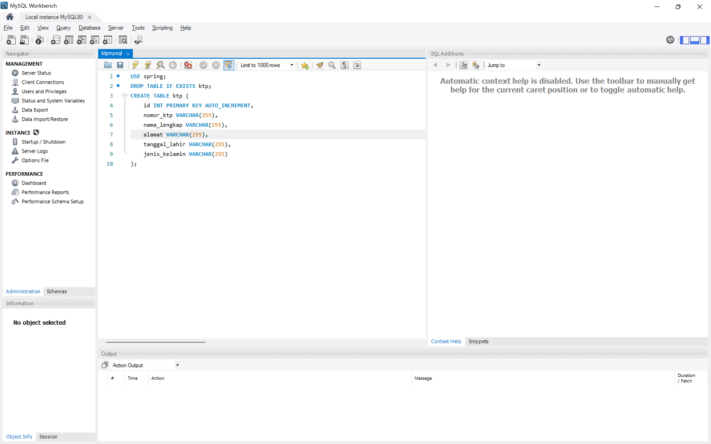
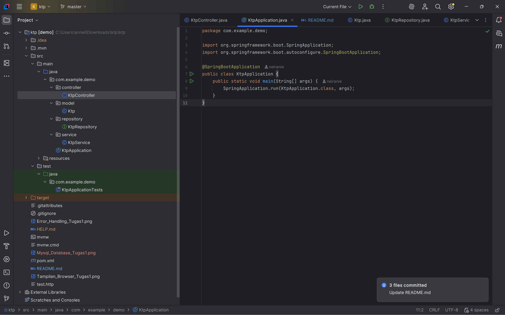
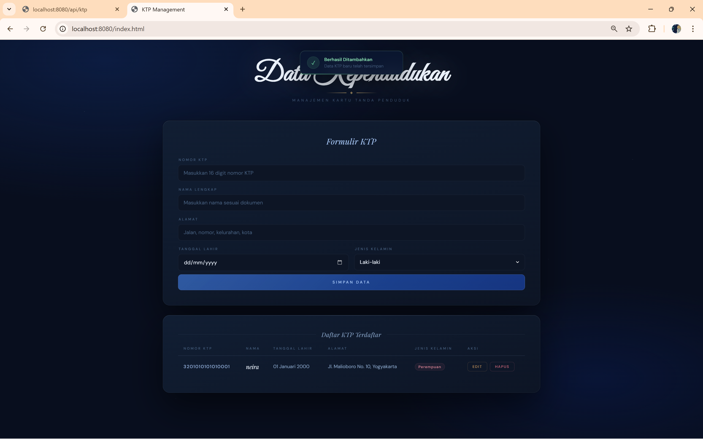
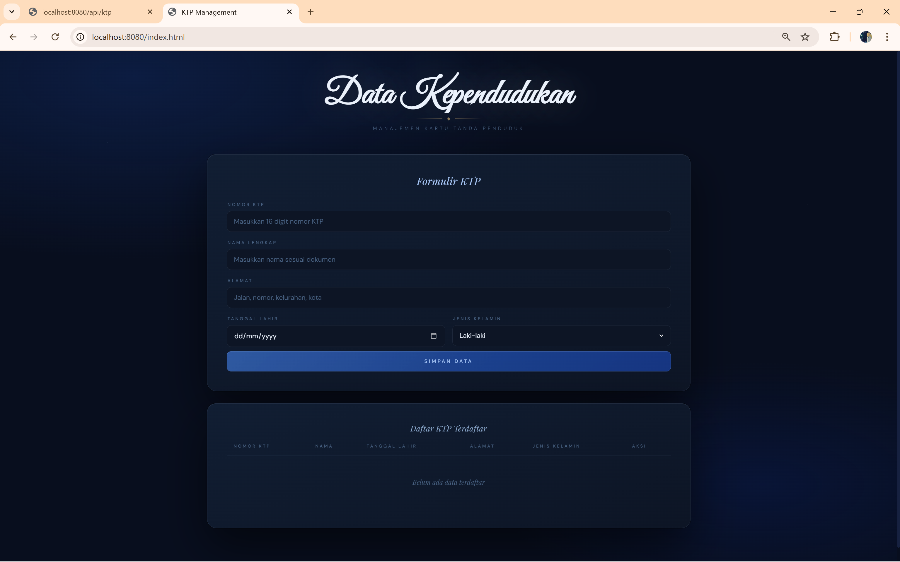
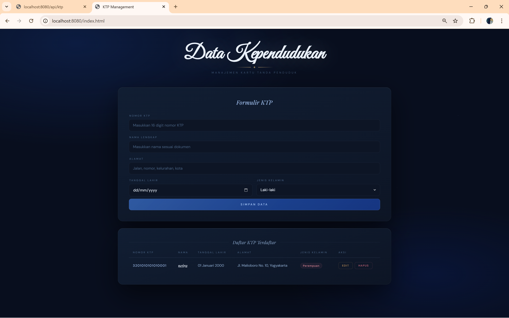
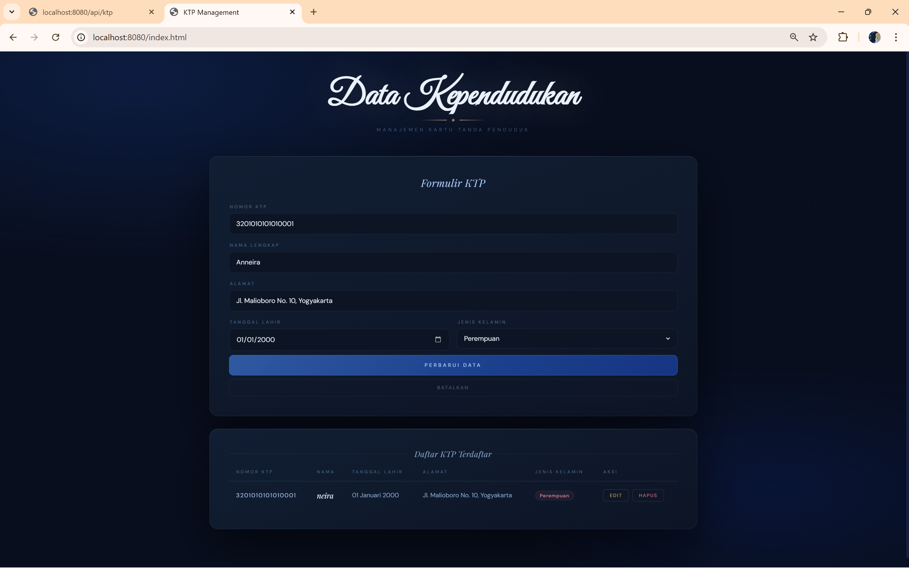
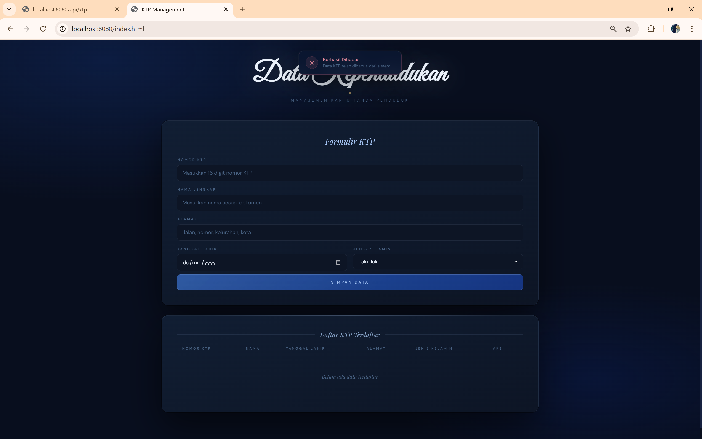

# Tugas 1: Membuat Program di Server dengan API untuk CRUD KTP menggunakan Spring Boot dan MySQL

### 1. Database MySQL 

### 2. Struktur Folder 

### 3. Hasil Browser 

### 4. Error Handling 

# Tugas 2: Membuat Program Client-side menggunakan HTML, CSS, JavaScript, dan Ajax JQuery
### 1. Create

### 2. Read

### 3. Update

### 4. Delete

